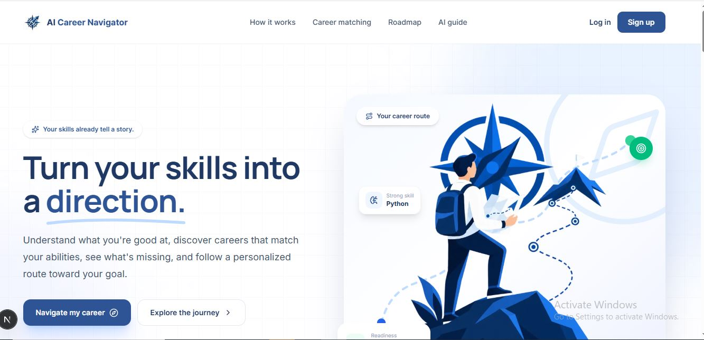
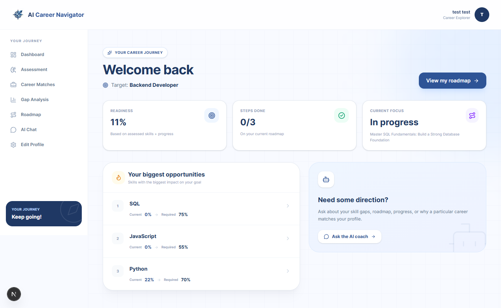
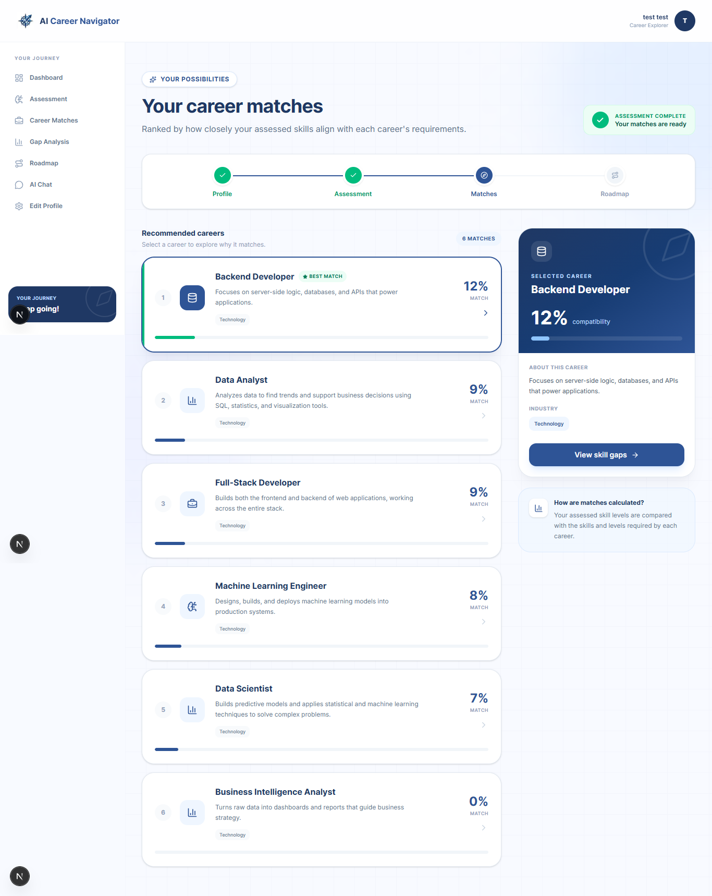
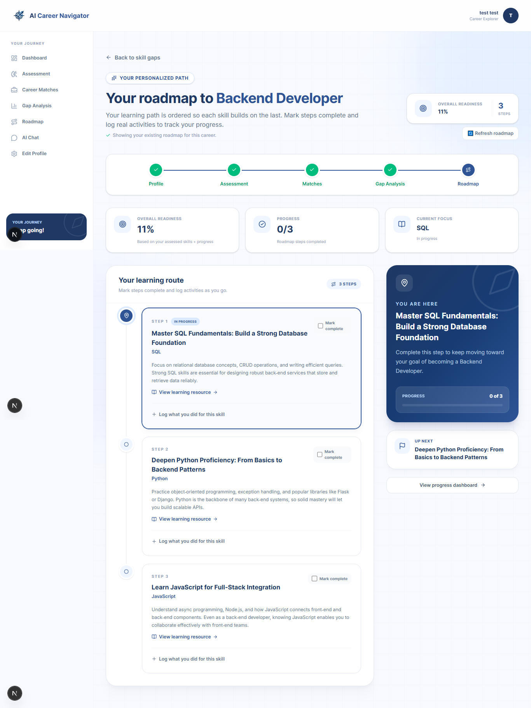
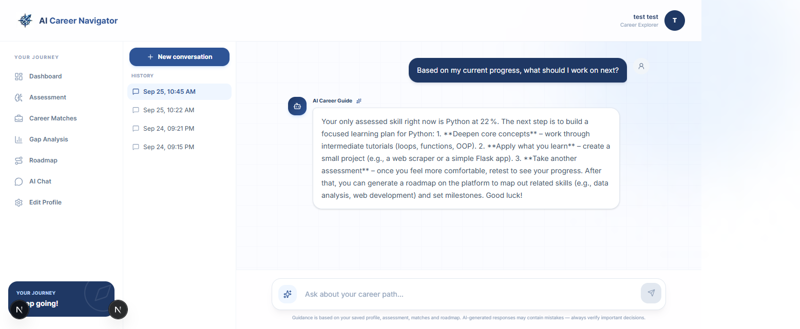
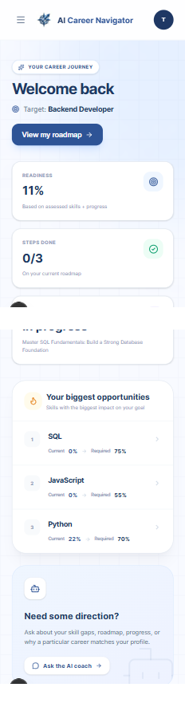

# AI Career Navigator

> AI-powered career discovery and roadmap platform — assess your real skills, get matched to careers with a deterministic scoring engine, understand your gaps, and follow a personalized, AI-generated learning roadmap.

Built by **Mohammad Shamma** — Capstone Project, [Program/Course Name], September 2026

---

## 🔗 Live Demo

| | |
|---|---|
| **Frontend (Vercel)** | `<add link after deployment>` |
| **Backend API (Railway)** | `<add link after deployment>` |
| **API Docs (Swagger)** | `<backend URL>/docs` |
| **GitHub Repository** | https://github.com/mohasham/DH_AI_Career_Navigator |

---

## 📸 Screenshots

> Screenshots live in `docs/screenshots/`. See [Adding Screenshots](#-adding-screenshots) below for exact steps and sizes.

### Landing Page




### Onboarding & Skill Selection


### Skill Assessment


### Dashboard



### Career Matches



### Gap Analysis


### Personalized Roadmap




### AI Career Chat



### Mobile View




---

## ✨ Key Features

- **Real, weighted skill assessments** — 5-question quizzes per skill, difficulty-weighted scoring, scored entirely server-side so results can't be spoofed
- **Deterministic career matching** — compatibility scores computed from real assessed skill levels against each career's requirements, never AI-guessed
- **Gap analysis** — precise, per-skill breakdown of what's missing for any career
- **AI-personalized roadmaps** — Groq-generated, ordered learning steps, grounded in real gap data with strict validation to prevent hallucinated skills or scores
- **Progress tracking & activity logging** — mark roadmap steps complete, log self-reported practice (capped at 80% until a real assessment is taken)
- **AI Career Chat** — a grounded conversational assistant that answers questions using the user's real skills, matches, and roadmap — never invents data it doesn't have
- **Full auth flow** — email/password and Google OAuth via Supabase, with route protection and Row Level Security
- **Fully responsive** — usable on mobile, tablet, and desktop, including a dedicated mobile navigation menu

---

## 🏗️ Tech Stack

| Layer | Technology |
|---|---|
| Frontend | Next.js 16 (App Router, Turbopack), TypeScript, Tailwind CSS v4, shadcn/ui |
| Backend | FastAPI (Python) |
| Database | PostgreSQL via Supabase |
| Auth | Supabase Auth (email/password + Google OAuth) |
| AI | Groq API (`openai/gpt-oss-20b`), JSON-mode structured output |
| Hosting | Vercel (frontend) + Railway (backend) |

---

## 🧠 Architecture Principle: AI Explains, Never Invents

Every AI-generated piece of content in this app (roadmap steps, chat responses) is **grounded in real, backend-computed data**:

- Skill levels come from actual quiz scores or capped activity logs — never guessed
- Career match percentages and gap calculations are deterministic backend math — AI never touches this logic
- The AI is explicitly instructed, validated, and tested to say "I don't have that information" rather than fabricate a skill, score, or achievement
- AI-generated roadmap steps are validated against the real skill catalog before being saved — any hallucinated skill reference is silently rejected

---

## 📁 Project Structure

```
ai-career-navigator/
├── frontend/          # Next.js app
│   ├── app/
│   │   ├── (app)/     # Shared layout: dashboard, matches, gap, roadmap, chat, profile
│   │   ├── auth/       # Login, register, OAuth callback
│   │   ├── assessment/[skill]/  # Standalone quiz page
│   │   └── onboarding/
│   ├── components/
│   └── lib/
├── backend/
│   ├── app/
│   │   ├── routers/    # One file per feature area
│   │   ├── schemas/    # Pydantic request/response models
│   │   ├── core/       # Auth, config
│   │   └── db/
│   └── migrations/     # SQL migration files, in order
└── docs/
    └── screenshots/    # See below
```

---

## 🚀 Running Locally

### Prerequisites
- Node.js 20+
- Python 3.11+
- A Supabase project
- A Groq API key

### Backend

```bash
cd backend
python -m venv venv
source venv/bin/activate   # or venv\Scripts\activate on Windows
pip install -r requirements.txt --break-system-packages
```

Create `backend/.env`:
```
SUPABASE_URL=your_supabase_url
SUPABASE_SERVICE_KEY=your_supabase_service_key
GROQ_API_KEY=your_groq_api_key
GROQ_MODEL=openai/gpt-oss-20b
```

```bash
uvicorn app.main:app --reload --port 8000
```

API docs available at `http://localhost:8000/docs`.

### Frontend

```bash
cd frontend
npm install
```

Create `frontend/.env.local`:
```
NEXT_PUBLIC_API_URL=http://localhost:8000
NEXT_PUBLIC_SUPABASE_URL=your_supabase_url
NEXT_PUBLIC_SUPABASE_ANON_KEY=your_supabase_anon_key
```

```bash
npm run dev
```

App available at `http://localhost:3000`.

### Database

Run the migration files in `backend/migrations/` against your Supabase project, in numeric order (`001_...` through `006_...`).

---

## 🔒 Security Notes

- All protected endpoints require a valid Supabase JWT, verified server-side
- Row Level Security enabled on all Supabase tables
- Chat sessions and messages are strictly scoped to their owning user — verified so one user cannot read another's private conversation, even by guessing a session ID
- Assessment answers and correct-answer keys are never sent to the frontend — scoring happens entirely server-side
- API keys and secrets are never committed to the repository — all read from environment variables

---

## 📸 Adding Screenshots

### Where to Put Them

Create the folder and add your images there:
```bash
mkdir -p docs/screenshots
```
Save each screenshot as a `.png` into `docs/screenshots/`, using the exact filenames already referenced above (e.g. `landing-hero.png`, `dashboard.png`) so they display automatically in this README once added — no other file needs editing.

### What Screen Sizes to Use

Take each screenshot at **one consistent desktop size** and, where noted, one mobile size — don't mix random window sizes, since inconsistent screenshot widths look unpolished side by side.

| Screenshot type | Recommended size |
|---|---|
| All desktop screenshots (landing, dashboard, matches, gap, roadmap, chat, assessment) | **1440 × 900** |
| Mobile screenshots (`mobile-dashboard.png`, `mobile-nav.png`) | **390 × 844** (iPhone 12/13/14 size) |

Use these exact sizes via your browser's device toolbar (steps below) — don't just resize the browser window freely, since that gives inconsistent, hard-to-reproduce dimensions.

### Steps to Create Each Screenshot

1. Open the app in Chrome or Edge, log in with a test account that has real data (tested skills, a generated roadmap, some chat history) — empty-state screenshots look far less convincing
2. Open Developer Tools (`F12`)
3. Click the device toolbar icon (or `Ctrl+Shift+M` / `Cmd+Shift+M`)
4. At the top, set the dimensions:
   - For desktop shots: select **"Responsive"** and manually type **1440 × 900**
   - For mobile shots: select **"Responsive"** and manually type **390 × 844**
5. Set the zoom/DPR dropdown to **100%** / **1** if shown, so the screenshot isn't scaled
6. Navigate to the exact page you need (see the list under [Screenshots](#-screenshots) above for which page maps to which filename)
7. Wait for all real data to finish loading (skill scores, career matches, roadmap steps, chat messages) before capturing — don't screenshot a loading spinner
8. Take the screenshot:
   - In Chrome/Edge dev tools, click the **three-dot menu** (⋮) in the device toolbar → **"Capture screenshot"** (captures exactly the emulated viewport, no browser chrome)
   - Alternatively, use your OS's screenshot tool (`Win+Shift+S` on Windows, `Cmd+Shift+4` on Mac) and manually crop to just the browser content
9. Save the file directly into `docs/screenshots/` using the **exact filename** listed in this README (e.g. `dashboard.png`) — matching names exactly means the image appears automatically with no other changes needed
10. Repeat for each page in the list until every placeholder above has a real image

### Quick Checklist of Files Needed

```
docs/screenshots/
├── landing-hero.png          (1440x900)
├── landing-journey.png       (1440x900)
├── onboarding.png            (1440x900)
├── skill-selection.png       (1440x900)
├── assessment-quiz.png       (1440x900)
├── assessment-results.png    (1440x900)
├── dashboard.png             (1440x900)
├── career-matches.png        (1440x900)
├── gap-analysis.png          (1440x900)
├── roadmap.png               (1440x900)
├── roadmap-activity.png      (1440x900)
├── ai-chat.png                (1440x900)
├── mobile-dashboard.png      (390x844)
└── mobile-nav.png            (390x844)
```

Once all 14 files are in place with these exact names, commit and push — the README will render them automatically on GitHub with no further edits needed.

---

## 👤 Author

**Mohammad Shamma**
GitHub: [@mohasham](https://github.com/mohasham)
